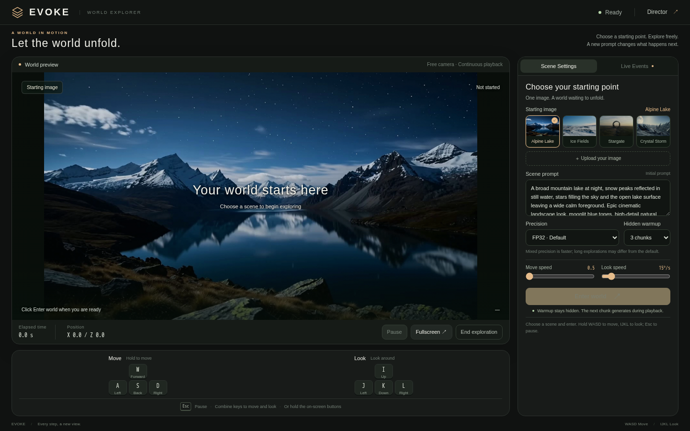
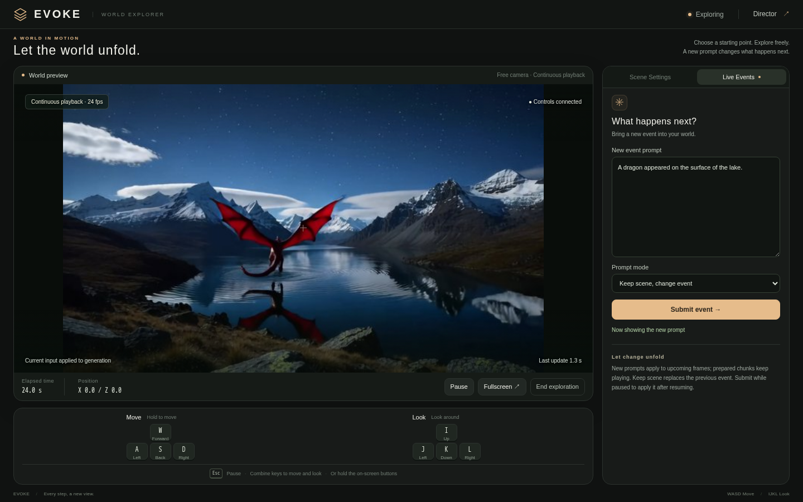

# Interactive UI

An English-language world-exploration interface with camera controls, live prompt switching, hidden scene warmup, and optimized EVOKE inference.

## Interface preview

Scene selection, generation settings, and adjustable movement and camera rotation speeds:



Live exploration with keyboard controls and the prompt event panel:



## Features

- WASD movement and IJKL camera rotation.
- Movement and rotation speed controls in the Scene Settings sidebar; movement defaults to 0.5 and rotation to 15 degrees per second.
- Live prompt events without restarting the world.
- Three hidden warmup chunks by default, adjustable from zero to six. Warmup updates model and point-cloud history without publishing those frames.
- Ordered 24 FPS playback, with buffering status in the top-right header and no buffering overlay.
- Native 640×384 output, 36 frames per chunk, three denoising steps, and a complete causal VAE. FP32 is the default VAE setting; mixed precision remains optional.
- Four GPUs for DiT sequence parallelism and one auxiliary GPU for geometry, warp rendering, and VAE encoding. VAE decoding runs on the primary DiT GPU.
- Fused warp sampling and visibility operations, cached VAE encoding graphs, VAE memory optimizations, asynchronous output, and coalesced control heartbeats.

## Setup

Use the EVOKE CUDA inference environment and the existing model weights. The source snapshot's inference dependencies are listed in `requirements.txt`; some development builds require the same working environment as the model release. Install the web dependencies and ensure `ffmpeg` is on PATH:

```bash
python -m pip install -r ui/requirements.txt
python launch.py --check
python launch.py
```

Run these commands from this directory. Provision weights at the relative paths listed in [models/README.md](models/README.md). All model configuration paths use `models/...`; there are no machine-specific checkpoint paths or included weights.

Open `http://127.0.0.1:7861/play/` after the model finishes loading. The launcher requires at least five GPUs and uses device indices 0–4 for inference. It creates its runtime files under `.runtime/`. Use `--host` and `--port` to select the listening address. Stop the launcher with Ctrl+C.

## Contents

- `ui/`: frontend, API, streaming, controls, and inference optimization modules.
- `evoke/`: model pipeline, geometry, kernels, and bundled third-party dependencies.
- `scripts/inference/`: post-distilled inference entry points.
- `configs/`: scheduler and optimized inference settings.
- `examples/segment_prompts/`: built-in reference scenes and pose examples.
- `benchmark.json` and `BENCHMARK.md`: measured chunk latency for this release.
- `SP_COMPARISON.md`: measured two-GPU versus four-GPU DiT timing.

The portable launcher uses direct WebSocket control on the same server. No hosted-platform proxy, credentials, deployment identifiers, generated sessions, or model files are included.

## Validation and limits

The frontend and matching optimized model path were measured on the existing five-H200 deployment. Comment removal was checked against Python syntax trees, and the core browser playback and input queue passed their regression checks. The cleaned package passed 54 CPU regression checks, and its standalone server served the interface and built-in references in an isolated API check. The portable launcher was checked without loading a second GPU service; its installation still requires the supplied model weights and a working EVOKE environment.

One chunk represents 1.5 seconds of video. Generation time and input-to-display response time are different: input sampling, generation, and transport may add waiting. Hidden warmup does not guarantee uninterrupted playback, and measured averages are not per-chunk latency guarantees. Mixed precision can change long-rollout outputs. Long-range visual camera-following degradation remains an open model-quality issue.

## Licenses

The project license is in `LICENSE`. Bundled dependency licenses remain with their source directories, and removed source-header notices are retained in `THIRD_PARTY_NOTICES.txt`.
